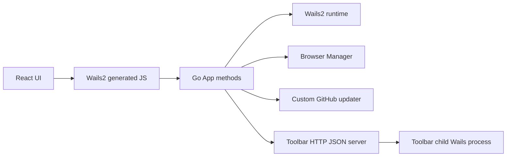
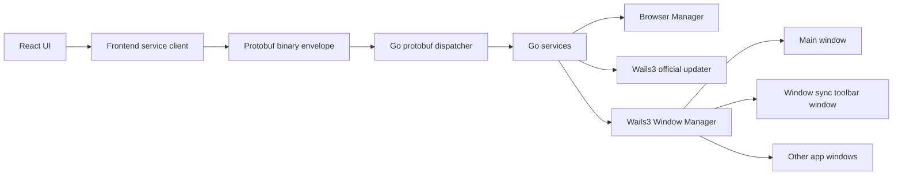

# Wails3 升级与通信层重构落地方案

## 背景

本文件最初用于规划当前分支从 Wails2 迁移到 Wails3 的落地路径。迁移前项目运行在 Wails2 技术栈上：

- Go 依赖使用 `github.com/wailsapp/wails/v2 v2.11.0`。
- `wails.json` 使用 `config.v2.json` schema，并通过 `wailsjsdir` 生成 `frontend/src/wailsjs`。
- `main.go` 通过 `wails.Run(&options.App{...})` 创建主窗口。
- 前端大量导入 `frontend/src/wailsjs/go/main/App` 和 `frontend/src/wailsjs/runtime/runtime`。
- 后端事件使用 Wails2 `runtime.EventsEmit`，前端使用 `EventsOn`。
- 窗口同步工具栏当前通过再次启动当前 exe 的方式运行为独立 Wails 子进程，并通过本地 HTTP JSON 接口 `/state`、`/command` 与主进程通信。
- 软件更新是自研 GitHub Releases 检查、下载、安装器启动和 ZIP 便携包自更新逻辑。

本方案目标是把当前分支升级为 Wails3 架构，同时重构通信层、窗口同步工具栏和软件内更新能力。

当前分支状态：

- 默认入口已切换为 Wails3-only，`main.go` 使用 Wails3 application/window 模型，`github.com/wailsapp/wails/v2`、旧 Wails2 runtime adapter、`wails.json` 和 `frontend/src/wailsjs` 已移除。
- 前后端业务通信已切到 Protobuf binary WebSocket transport；Wails3 generated bindings 不再暴露业务 service 方法，也不作为旧 binding 兜底。
- React 页面不整体重写，后端访问层已收敛到 `frontend/src/shared/backend` 与 `frontend/src/shared/ipc`，业务模块 `api.ts` 保持原函数语义并改走 Protobuf。
- 窗口同步工具栏已从独立子进程 + HTTP JSON 控制面改为 Wails3 同进程多窗口 + Protobuf command/event。
- 软件更新已接入 Wails3 官方 `selfupdate` service 运行时：检查、下载、应用、重启分别走官方 service 的 `Check`、`Download`、`Install`、`Restart`；前端仍只走项目 Protobuf 通道，不暴露 Wails binding 业务方法。

## 参考资料

- 官方迁移指南：[Wails2 到 Wails3 迁移指南](https://v3.wails.io/migration/v2-to-v3/)
- 官方窗口能力：[Wails3 Windows](https://v3.wails.io/features/windows/)
- 官方多窗口能力：[Wails3 Multiple Windows](https://v3.wails.io/features/windows/multiple/)
- 官方绑定能力：[Wails3 Bindings](https://v3.wails.io/features/bindings/)
- 官方应用更新能力：[Wails3 Auto Updates](https://v3.wails.io/guides/distribution/auto-updates/)

注意：Wails3 不是 Wails2 的小版本替换。迁移时需要按 Wails3 的应用、服务、窗口、绑定和构建模型重新接入，不能只改 import path。

## 升级目标

### 必做目标

1. Wails2 升级到 Wails3。
2. 通信层从 JSON over IPC 升级到 Protocol Buffers 二进制协议。
3. 窗口同步和窗口同步状态栏升级为 Wails3 多窗口模式。
4. 软件更新改为使用 Wails3 官方内置的软件内更新能力。
5. 重构 React 后端访问层，页面组件不整体重写，业务 UI 尽量保持现状。
6. 保持现有核心业务能力：浏览器实例、代理池、内核管理、扩展管理、备份恢复、Launch API、系统托盘、关闭确认。

### 非目标

第一轮升级不重做业务模型、不重写浏览器实例管理、不整体重写 React 页面、不改数据库结构，除非 Wails3 或 Protobuf 通信层需要新增协议表或元数据。

## 影响面与当前状态

| 模块 | 迁移前实现 | 当前状态 |
| --- | --- | --- |
| 应用启动 | `main.go` 使用 Wails2 `wails.Run` | 已完成：默认 Wails3 application/window/lifecycle，旧入口已删除 |
| 配置 | `wails.json` v2 schema | 已完成：使用 `build/config.yml` 与 `Taskfile.yml`，脚本读取 Wails3 配置 |
| Go 依赖 | `github.com/wailsapp/wails/v2` | 已完成：依赖切到 `github.com/wailsapp/wails/v3`，v2 依赖已移除 |
| 前端绑定 | `frontend/src/wailsjs/go/main/App` | 已完成：旧 `wailsjs` 删除，Wails3 bindings 只保留 runtime/internal 生成物，不暴露业务方法 |
| 前端 runtime | `frontend/src/wailsjs/runtime/runtime` | 已完成：页面通过项目 runtime/backend 适配层与 Protobuf event bus |
| 事件 | `runtime.EventsEmit` / `EventsOn` | 已完成：业务事件走 Protobuf binary event，文件拖拽等 Wails3 事件进入统一事件总线 |
| 文件对话框 | `OpenFileDialog` / `SaveFileDialog` | 已完成：后端平台层封装 Wails3 dialogs，前端经 Protobuf API 调用 |
| 窗口控制 | `WindowSetSize`、`WindowSetPosition`、`WindowSetAlwaysOnTop` | 已完成：主窗口和工具栏窗口控制收口到 Wails3 platform/window adapter |
| 同步工具栏 | 独立 exe 子进程 + HTTP JSON | 已完成：同进程 Wails3 子窗口 + Protobuf command/event，旧 HTTP 控制面不再作为兜底 |
| 软件更新 | 自研 GitHub Releases 更新器 | 已完成：后端更新运行时切到 Wails3 官方 `selfupdate` service，Windows workflow 额外生成官方运行时需要的 self-update ZIP 资产 |
| 打包脚本 | `wails build`、`wails generate module` | 已完成：脚本和 GitHub Actions 使用 `wails3 build` / `wails3 generate bindings` |

## 总体架构

### 迁移前



### 迁移后



## 关键设计

### Wails3 应用层

新增应用层封装，避免把 Wails3 API 直接散落在业务代码中。

建议新增：

- `backend/platform/wailsapp`
  - 创建 Wails3 application。
  - 注册服务和生命周期。
  - 创建主窗口。
  - 创建窗口同步工具栏窗口。
  - 封装事件、对话框、退出、打开 URL、窗口控制。

迁移原则：

- 业务 App 继续承载浏览器、代理、配置、数据库逻辑。
- Wails3 特有能力集中在平台层。
- 前端不直接依赖生成绑定路径，统一从项目封装 API 导入。

### Protobuf 通信层

目标是把前后端业务通信从 JSON payload 切到 Protobuf 二进制消息。

建议新增目录：

- `proto/trace/v1/common.proto`
- `proto/trace/v1/browser.proto`
- `proto/trace/v1/window_sync.proto`
- `proto/trace/v1/settings.proto`
- `proto/trace/v1/update.proto`
- `backend/internal/transport/proto`
- `frontend/src/shared/proto`
- `frontend/src/shared/ipc`

统一 envelope：

```protobuf
syntax = "proto3";

package trace.v1;

message RpcEnvelope {
  string request_id = 1;
  string method = 2;
  bytes payload = 3;
  int32 schema_version = 4;
  int64 timestamp_ms = 5;
}

message RpcError {
  string code = 1;
  string message = 2;
  string details = 3;
}

message RpcResponse {
  string request_id = 1;
  bytes payload = 2;
  RpcError error = 3;
}
```

落地策略：

1. 先做最小 Protobuf POC：前端发送 `PingRequest`，后端返回 `PingResponse`。
2. 验证 Wails3 是否能稳定传递 `Uint8Array` / `[]byte`。
3. 如果 Wails3 官方绑定可直接承载二进制，则使用 Wails3 绑定作为底层传输。
4. 如果 Wails3 绑定只能稳定承载 JSON 或字符串，则使用本地 loopback WebSocket / named pipe 作为二进制传输层，Wails3 只负责窗口和应用生命周期。
5. 不把未验证的二进制能力写死到业务代码，先用 `transport.Client` / `transport.Dispatcher` 隔离。

迁移顺序：

- 高频和状态同步优先迁移：窗口同步、浏览器实例状态、代理测速事件、下载进度、更新进度。
- 普通 CRUD 后迁移：配置、分组、书签、默认内容、扩展管理。
- 外部 Launch API 保持 HTTP JSON，不纳入本次前后端 IPC 重构，避免破坏外部集成。

兼容期约束：

- 允许短期保留少量 Wails3 生成绑定用于 bootstrap、打开窗口、文件对话框、退出应用。
- 业务数据接口最终收敛到 Protobuf service client。
- 已迁移到 Protobuf 的业务接口不再保留旧 Wails binding 兜底；若 Protobuf 通道不可用，应暴露错误并修复新通道。

当前落地状态：

- 已新增 `proto/trace/v1/common.proto`、`proto/trace/v1/dev.proto`，先定义统一 envelope、错误响应和 `trace.dev.Ping`。
- 已新增 Go 侧 `backend/internal/transport/protoipc`，使用 `google.golang.org/protobuf/encoding/protowire` 落地 Protobuf wire 编解码、dispatcher、错误映射和 Ping POC。
- 早期曾在 Wails3 实验入口验证 `RawMessageHandler`，确认当前 Wails3 alpha 的 raw message handler 暴露为 `string`，不适合作为最终二进制帧承载层。
- 已新增前端 `frontend/src/shared/ipc` 和 `frontend/src/shared/backend/client.ts`，具备 request id、超时、并发请求映射、错误解码和 Ping client。
- 最终承载层已切为本地 `127.0.0.1` WebSocket binary transport，使用一次性随机 token，迁移后的业务请求只走 binary WebSocket。
- 当前 request/response 已具备真正二进制帧承载；已补齐 WebSocket binary event 广播和前端订阅/取消订阅入口。代码生成链路和功能域协议仍按后续阶段继续收敛。
- R5 设置、备份、更新通信层已接入 Protobuf-only：AppConfig、打开路径、打开 release 页面、备份初始化/导出/导入、更新检查/下载/安装/便携包下载及相关进度/待安装事件均不再保留旧 Wails binding 兜底；更新运行时已切到 Wails3 官方 `selfupdate` service。
- 当前 `github.com/wailsapp/wails/v3 v3.0.0-alpha.95` 尚未发布文档中的 `CreateUpdaterService` API，但官方仓库 `v3/feat/self-update` 分支已提供 `pkg/services/selfupdate` service；本项目已按该官方 service 接入运行时，并保留 Protobuf 作为唯一前端访问层。
- R6 低频浏览器 API 已继续收敛：默认书签、默认打开页、默认内容联动规则、浏览器实例快照、Cookie 管理、用户数据目录打开动作、扩展管理、浏览器设置已接入 Protobuf-only，旧 Wails binding/mock 兜底已移除。
- R7 窗口同步通信层已完成：主窗口侧候选列表、启动/停止、暂停/恢复、展示窗口、布局、同步设置和状态变化事件已接入 Protobuf-only；Wails3 悬浮工具栏已改为同进程多窗口，并通过同一套 Protobuf client 调用命令和同步尺寸。
- R8 旧访问层清理已完成：仪表盘、授权/CDKey、资料页远程作者配置、应用日志列表/清空、App 退出控制、窗口尺寸/状态/隐藏/最小化、外部链接、业务事件订阅和文件拖拽事件已接入 Protobuf-only，相关前端模块已移除旧 Wails binding、旧 runtime、`window.go` 兜底和未使用的 runtime 空壳导出。

### 前端 API 适配层

迁移前页面直接调用 `../../wailsjs/go/main/App`。迁移时先新增适配层，减少页面级大规模改动；当前业务页面已改为通过项目访问层和 Protobuf client 访问后端。

建议：

- `frontend/src/shared/backend/client.ts`
  - 负责初始化 transport。
  - 暴露 typed request/event API。
- `frontend/src/shared/backend/runtime.ts`
  - 封装事件、窗口、对话框、打开链接、退出等 runtime 能力。
- 各业务模块的 `api.ts` 继续导出原来的函数名，但内部改为调用 Protobuf client。

验收要求：

- 页面组件不直接 import `wailsjs`。
- 生成绑定路径变化不会影响业务页面。
- 所有事件订阅有统一取消订阅机制。

### React 后端访问层分阶段重构计划

React 不做整体重写，页面组件和现有交互优先保留。重构范围集中在“页面如何访问后端”这一层：

- `frontend/src/shared/backend/client.ts`：统一业务请求入口。
- `frontend/src/shared/backend/runtime.ts`：统一窗口、事件、对话框、打开链接、退出等 Wails runtime 能力。
- `frontend/src/shared/ipc/*`：Protobuf encode/decode、request id、超时、错误映射、event bus。
- 各模块 `api.ts`：保留对页面暴露的函数名和返回语义，内部逐步切到新 client。
- 窗口入口：主窗口、窗口同步工具栏窗口、后续子窗口共用同一套 backend client。

分阶段原则：

1. 先建访问层，再迁移业务模块。
2. 每次只迁移一个功能域，迁移后必须完成该功能域回归。
3. 迁移阶段曾按功能域逐步切换；当前业务访问层已经全部收敛到 Wails3/Protobuf 通道，不再保留旧 Wails binding 兜底。
4. 每个阶段完成后，现有功能必须可启动、可操作、可退出。
5. 如果迁移中发现更好的方案或功能增强，先记录增强项，再在当前功能稳定后纳入本阶段或后续阶段；增强功能也必须有验收标准。
6. 不为了通信层升级改变用户可见流程，除非增强能明显提升稳定性、性能或体验。

| 子阶段 | 范围 | 改造内容 | 可用性验收 | 进度 |
| --- | --- | --- | --- | --- |
| R0 | 调用面盘点 | 扫描所有 `wailsjs`、`EventsOn`、runtime、文件对话框、窗口控制调用，建立迁移清单 | 清单覆盖主窗口、设置页、浏览器模块、窗口同步工具栏、更新、备份、拖拽 | 已完成 |
| R1 | runtime 适配层 | 新增 `shared/backend/runtime.ts`，封装事件、窗口控制、打开链接、退出、文件拖拽、文件对话框 | `App.tsx` 关闭确认、托盘退出、打开链接、文件导入/导出仍可用 | 已完成 |
| R2 | Protobuf client | 新增 `shared/ipc` 和 `shared/backend/client.ts`，完成 request/response/event POC | Ping、错误返回、超时、并发请求、事件订阅和取消订阅正常 | 已完成 2A/2B：binary request/response/event POC；代码生成链路待功能域迁移时扩展 |
| R3 | 浏览器实例 API | 迁移 `modules/browser/api.ts` 中实例列表、启动、停止、重启、复制、标签、分组基础能力 | 浏览器列表、新建/编辑/复制/删除、启动/停止/重启、分组筛选正常 | 已完成：实例列表/按标签筛选/新建/编辑/复制/删除/启动/停止/重启/LaunchCode/标签/关键字/分组/实例辅助操作已接入 Proto，旧 binding 兜底已移除 |
| R4 | 代理与内核 API | 迁移代理池、测速、IP 健康检测、内核下载和下载进度事件 | 代理导入、测速、IP 检测、内核下载进度和错误提示正常 | 已完成：代理池、测速/IP 健康、Clash 导入、内核管理和下载进度事件已接入 Proto，旧 binding/mock 兜底已移除 |
| R5 | 设置、备份、更新 API | 迁移设置页后端调用、备份导入导出、官方 updater 适配和进度事件 | 初始化、导入、导出、检查更新、下载更新、安装更新流程正常 | 已完成：设置、备份、更新 API 和事件均为 Protobuf-only；更新运行时切到 Wails3 官方 `selfupdate` service；Windows 发布链路生成 self-update ZIP |
| R6 | 扩展、书签、默认内容、快照 API | 迁移扩展管理、书签、默认内容、快照等低频 CRUD | 列表、详情、创建、编辑、删除、导入/导出类操作正常 | 已完成：默认书签、默认打开页、默认内容联动规则、快照、Cookie 管理、用户数据目录打开动作、扩展管理、浏览器设置已接入 Protobuf-only |
| R7 | 窗口同步窗口 API | 工具栏窗口改为多窗口入口，命令和状态事件走 Protobuf client | 开始同步、工具栏显示、暂停/恢复、停止、布局、批量输入、标签控制正常 | 已完成：主窗口和悬浮工具栏均为 Protobuf-only；Wails3 工具栏已切到同进程多窗口，旧子进程 HTTP JSON 不再作为兜底 |
| R8 | 清理旧访问层 | 删除业务页面对 `wailsjs/go/main/App` 和旧 runtime 的直接依赖 | `rg "wailsjs/go/main/App" frontend/src` 无业务页面直接引用，前端构建通过 | 已完成：业务源码无 `wailsjs`、`window.go`、`appBindings` 和旧 runtime 空壳调用；旧 Wails2 生成目录已删除 |

功能回归清单：

- 首页和仪表盘加载正常。
- 浏览器实例列表、筛选、分页、标签、分组正常。
- 浏览器实例新建、编辑、复制、删除、启动、停止、重启正常。
- 代理池导入、编辑、删除、测速、IP 健康检测正常。
- 内核管理列表、校验、下载、下载进度正常。
- 扩展管理导入、绑定、解绑、自动绑定正常。
- 默认内容、书签、快照功能正常。
- 窗口同步选择、启动、状态栏、工具栏、布局、批量输入、标签控制正常。
- 设置页系统初始化、备份导入导出、软件更新正常。
- 文件拖拽、文件选择、保存对话框、打开链接正常。
- 关闭确认、托盘显示、仅退出应用、完整退出正常。

增强项处理规则：

- 迁移过程中发现更好的方案时，先写入当前阶段的“增强候选”。
- 如果增强不扩大风险且能提升稳定性，可以随当前阶段一起做。
- 如果增强会改变用户流程、数据结构或发布流程，必须拆到独立子阶段。
- 增强完成后必须补充验收标准，不能只做代码改造不做功能回归。
- 若增强影响现有功能，优先保证原功能可用，再打开增强入口。

### 多窗口模式

窗口同步工具栏从“独立子进程 + HTTP JSON”迁移为“同进程 Wails3 子窗口”。

建议新增：

- `backend/window_manager.go`
- `backend/window_sync_window.go`
- `frontend/src/windows/sync-toolbar`

窗口职责：

- 主窗口：浏览器实例管理、设置、更新、完整业务 UI。
- 窗口同步工具栏窗口：悬浮、置顶、透明、可折叠控制栏。
- 后续可扩展窗口：更新进度窗口、日志窗口、代理测速窗口。

迁移后删除或废弃：

- `--window-sync-toolbar` 子进程启动路径。
- `windowSyncToolbarController.ensureServer` 的本地 HTTP server。
- 工具栏 `fetch('http://127.0.0.1:{port}/state')` 和 `fetch('/command')`。
- 工具栏环境变量注入的 token/port 通信。

多窗口通信：

- 主进程保存唯一 `WindowSyncState`。
- 工具栏窗口通过 Protobuf request 调用命令。
- 状态变化通过 Protobuf event 广播给主窗口和工具栏窗口。
- 窗口控制通过 WindowManager 指定目标窗口执行，例如工具栏窗口 resize、position、always-on-top。

### 窗口同步状态栏

状态栏升级为多窗口模式后分两层：

- 主窗口内状态栏：展示当前同步状态、主控窗口、窗口数量、暂停/运行状态。
- 悬浮工具栏窗口：执行快捷操作、批量输入、标签控制、布局切换、设置。

状态来源统一：

- `WindowSyncStateChanged` protobuf event。
- 主窗口和工具栏不各自轮询后端。
- 必须保留手动刷新兜底，用于窗口恢复或事件丢失后的状态修正。

### 官方内置更新

当前 `backend/app_update.go` 已完成 Protobuf-only 通信层，并把运行时更新替换为 Wails3 官方 `selfupdate` service。检查更新走官方 GitHub provider，下载进度由 service progress callback 转成 Protobuf event，安装走 service executor，完成后调用 service restart。

保留前端功能语义：

- 检查更新。
- 展示当前版本、最新版本、更新说明。
- 下载更新。
- 显示下载进度。
- 安装并重启。
- 打开发布页作为兜底。

改造方向：

- 后端通过 Wails3 官方 `selfupdate` service 检查 GitHub Releases，匹配 `TraceBrowser-SelfUpdate-{version}-{platform}.zip` 运行时资产。
- 发布流程生成 Wails updater 需要的 self-update ZIP、manifest、hash 和平台资产；签名字段等待官方最终格式确认后补齐。
- 前端 `settings/api.ts` 保留函数名，但返回结构改为由官方 updater 适配。
- 官方 self-update ZIP 内只包含可替换的 `trace-browser.exe`，用于运行时替换；完整安装包和便携包仍作为手动/完整分发资产保留。

发布脚本影响：

- `bat/build.ps1`
- `bat/build.bat`
- `tools/public-release/*`
- `publish/*`
- `publish/linux/*`
- `publish/mac/*`
- `scripts/sync-wails-version.ps1`

验收要求：

- Windows 安装版可以在软件内检查、下载、安装新版本。
- 下载进度能实时显示。
- 更新失败能回退到打开发布页。
- 当前版本号仍从构建配置或发布 tag 稳定同步。

## 阶段拆分

### 阶段 0：方案落地

目标：

- 输出本升级方案文档。
- 明确迁移范围、阶段、验收标准和风险验证项。

交付物：

- `docs/wails3-upgrade-plan.md`

验收标准：

- 文档覆盖 Wails3、Protobuf、多窗口、官方更新四个目标。
- 明确当前仓库影响面。
- 明确每个阶段的交付物和暂停点。

完成后暂停点：

- 等待确认后再进入阶段 1。

### 阶段 1：Wails3 基线迁移

目标：

- 项目能以 Wails3 启动主窗口。
- 保持现有 React 页面能加载。
- 后端业务初始化、托盘、关闭流程、窗口状态保存能跑通。

后端任务：

- 替换 Go 依赖到 Wails3。
- 重写 `main.go` 应用启动。
- 迁移主窗口创建、生命周期、关闭拦截、托盘回调。
- 封装 Wails3 runtime adapter。
- 迁移打开 URL、退出、窗口显示、窗口最小化/恢复。

前端任务：

- 重生成 Wails3 bindings。
- 新增 `shared/backend/runtime.ts`。
- 替换直接 runtime import 的核心入口。
- 保持 `npm run build` 可通过。

脚本任务：

- 更新 Wails3 配置文件 `build/config.yml`。
- 更新 `bat/generate-bindings.bat`。
- 更新 `bat/dev.bat` 和 `bat/build.ps1` 中的 CLI 命令。
- 保留 `WAILS_BIN` / `WAILS3_BIN` 环境变量，便于指定 Wails3 CLI。

验收标准：

- `go test ./...` 通过。
- `npm run build` 通过。
- Windows 开发模式可启动主窗口。
- 主窗口关闭拦截、托盘显示/退出逻辑正常。
- 不再引用 `github.com/wailsapp/wails/v2`。

完成后暂停点：

- 阶段 1 验收通过后暂停，确认再进入阶段 2。

### 阶段 2：Protobuf 通信 POC

目标：

- 建立 Protobuf 代码生成链路。
- 完成前端到后端的二进制 request/response POC。
- 完成后端到前端的二进制 event POC。

当前进度：

- 2A 已完成：协议文件、Go wire 编解码、dispatcher、Wails3 raw message 接入、React `shared/ipc` client、Ping POC 和错误/超时/并发基础设施。
- 2B 已完成：确认 Wails3 raw message 当前为 string 通道，新增本地 WebSocket binary transport 作为默认 Wails3 壳下的 Protobuf 二进制承载层；协议层 100 并发、1MB payload、WebSocket binary Ping、WebSocket binary event 和非法 token 拒绝已由 Go 测试覆盖。
- 功能域协议和业务事件 payload 类型已按 R3-R8 扩展完成；后续可评估是否从当前轻量 wire codec 切到统一代码生成工具链。

后端任务：

- 引入 `google.golang.org/protobuf` 和 Go 代码生成。进度：已引入 protobuf wire 编码，代码生成链路待业务协议扩展时确认。
- 新增 `proto/trace/v1/common.proto` 和 `dev.proto`。进度：已完成。
- 新增 `transport.Dispatcher`。进度：已完成。
- 实现 `trace.dev.Ping`。进度：已完成。
- 实现统一错误映射。进度：已完成基础错误响应。

前端任务：

- 引入 Protobuf TS 生成工具。进度：待业务协议扩展时确认，当前 POC 先使用轻量 wire codec。
- 新增 `shared/ipc/client.ts`。进度：已完成。
- 实现 request id、超时、错误解码。进度：已完成。
- 实现事件订阅和取消订阅。进度：已完成 WebSocket binary event bus 和前端 `onProtoEvent` 订阅/取消订阅入口，业务事件 payload 待迁移功能域时扩展。
- 实现二进制承载层。进度：已完成，前端业务 Protobuf client 使用 `window.__TRACE_PROTO_IPC__.wsUrl` 的 WebSocket binary transport，不再自动回退旧 binding。

验证点：

- 验证 Wails3 是否能原生传递二进制。
- 验证大 payload、并发 request、超时、错误返回。
- 验证开发模式和生产构建下行为一致。

验收标准：

- 前端 `PingRequest` 发送二进制 payload，后端返回 `PingResponse`。
- 后端主动发送 protobuf event，前端能订阅并解码。
- 并发 100 个小请求无串包。
- 1MB payload 能正确传输，或明确记录当前传输上限和后续策略。

完成后暂停点：

- 阶段 2 验收通过后，确认最终二进制传输方案，再进入阶段 3。

### 阶段 3：业务 API 迁移到 Protobuf

目标：

- 将核心业务 API 从 Wails JSON binding 迁移到 Protobuf service。
- 前端业务函数名尽量保持不变。
- 按 React 后端访问层分阶段计划执行，保证每迁移一个功能域就完成对应回归。

优先级：

1. 浏览器实例状态与操作。
2. 窗口同步状态与命令。
3. 代理测速、IP 健康检测、下载进度事件。
4. 设置、备份、分组、标签、书签。
5. 扩展、默认内容、内核管理。

后端任务：

- 按模块拆分 proto service。
- 建立 Go domain model 与 proto model 转换层。
- 移除业务 API 对 Wails generated binding 的直接依赖。
- 统一分页、批量操作、错误码。

前端任务：

- 各模块 `api.ts` 内部迁移到 protobuf client。
- 页面组件不直接感知通信协议变化。
- 事件订阅从 `EventsOn` 迁移到 typed event bus。
- 保留模块 `api.ts` 的函数名和主要返回语义，减少页面组件改动。
- 每迁移一个模块，更新对应功能回归清单和进度状态。

当前进度：

- 已新增 `proto/trace/v1/browser.proto`，覆盖 `BrowserProfile`、`BrowserProfileInput`、列表、新建、更新、删除、复制、启动、停止、重启、LaunchCode 启动/查询/重置/设置、启动服务信息、标签、关键字、分组、实例辅助操作请求和响应。
- 已新增 `trace.browser.ProfileList`、`trace.browser.ProfileCreate`、`trace.browser.ProfileUpdate`、`trace.browser.ProfileDelete`、`trace.browser.ProfileCopy`、`trace.browser.InstanceStart`、`trace.browser.InstanceStop`、`trace.browser.InstanceRestart`、`trace.browser.InstanceStartByCode`、`trace.browser.TagList`、`trace.browser.ProfileSetKeywords`、`trace.browser.ProfileBatchSetTags`、`trace.browser.ProfileBatchRemoveTags`、`trace.browser.TagRename`、`trace.browser.GroupList`、`trace.browser.GroupCreate`、`trace.browser.GroupUpdate`、`trace.browser.GroupDelete`、`trace.browser.GroupMoveProfiles`、`trace.browser.InstancePinCenter`、`trace.browser.ProfileSwitchProxyNow`、`trace.browser.InstanceOpenURL`、`trace.browser.InstanceTabList`、`trace.browser.ProfileCodeGet`、`trace.browser.ProfileCodeRegenerate`、`trace.browser.ProfileCodeSet`、`trace.browser.LaunchServerInfo` handler，并把 Wails3 Proto dispatcher 绑定到现有 `App`，后端复用现有实例管理业务逻辑。
- 前端 `fetchBrowserProfiles`、`fetchBrowserProfilesByTag`、`createBrowserProfile`、`updateBrowserProfile`、`deleteBrowserProfile`、`copyBrowserProfile`、`startBrowserInstance`、`startBrowserInstanceByCode`、`stopBrowserInstance`、`restartBrowserInstance`、`fetchAllTags`、`setProfileKeywords`、`batchSetProfileTags`、`batchRemoveProfileTags`、`renameBrowserTag`、`fetchGroups`、`createGroup`、`updateGroup`、`deleteGroup`、`moveInstancesToGroup`、`pinCenterBrowserInstance`、`switchBrowserProfileProxyNow`、`openBrowserUrl`、`fetchBrowserTabs`、`fetchLaunchServerInfo`、`getBrowserProfileCode`、`regenerateBrowserProfileCode`、`setBrowserProfileCode` 已彻底切到 Protobuf，不再回退旧 Wails binding；若 Wails3 binary transport 未注入，会等待配置事件后再请求。
- 已补充 BrowserProfile 列表、写操作、实例运行态、标签、关键字、分组、标签页、LaunchCode、启动服务信息请求 Protobuf 编解码 round-trip 测试。
- 已新增 `proto/trace/v1/proxy.proto`、`backend/proto_proxy.go`、`backend/internal/transport/protoipc/wire_proxy.go` 和 `frontend/src/shared/ipc/proxy.ts`；`trace.browser.ProxyList`、`ProxyGroupList`、`ProxySave`、`ProxyFetchClashByURL`、`ProxyValidateConfig`、`ProxyTestConnectivity`、`ProxyTestRealConnectivity`、`ProxyTestSpeed`、`ProxyBatchTestSpeed`、`ProxyPreviewBatchTestSpeed`、`ProxyCheckIPHealth`、`ProxyBatchCheckIPHealth`、`ProxyPreviewBatchCheckIPHealth` 已接入 dispatcher。前端代理列表/分组/保存、Clash URL 导入、验证、连通性、测速、IP 健康检测及 `proxy:*` 实时结果事件已彻底切到 Protobuf binary transport，不再保留旧 Wails binding 或 mock 兜底。
- 已新增 `proto/trace/v1/core.proto`、`backend/proto_core.go`、`backend/internal/transport/protoipc/wire_core.go` 和 `frontend/src/shared/ipc/core.ts`；`trace.browser.CoreList`、`CoreSave`、`CoreDelete`、`CoreSetDefault`、`CoreValidate`、`CoreExtendedInfo`、`CoreScan`、`CoreDownload`、`CoreOpenPath` 已接入 dispatcher。前端内核列表、保存、删除、设为默认、路径验证、扩展信息、扫描、打开路径、下载启动及 `download:progress` 下载进度事件已彻底切到 Protobuf binary transport，不再保留旧 Wails binding 或 mock 兜底。

验收标准：

- 浏览器列表、新建、编辑、复制、删除、启动、停止、重启正常。
- 代理池测速和 IP 检测事件正常显示。
- 核心管理下载进度正常显示。
- 备份导入导出进度正常显示。
- 扩展、书签、默认内容、快照等低频功能至少完成 smoke test。
- 前端没有业务页面直接 import `wailsjs/go/main/App`。
- 业务模块不再依赖旧 JSON binding；新增 API 必须直接走 Protobuf service client。

完成后暂停点：

- 阶段 3 验收通过后暂停，确认再进入阶段 4。

### 阶段 4：窗口同步多窗口迁移

目标：

- 窗口同步工具栏升级为 Wails3 多窗口子窗口。
- 移除子进程和 HTTP JSON 控制面。
- 主窗口状态栏和工具栏窗口共享同一份同步状态。

后端任务：

- 新增 Wails3 工具栏 adapter，主进程内创建 `window-sync-toolbar` 子窗口。进度：已完成。
- 创建工具栏窗口，设置定位、置顶、透明、隐藏任务栏和尺寸切换。
- 将工具栏命令改为 Protobuf request。
- 将同步状态变更改为 Protobuf event 广播。
- Wails3 路径不再调用 `windowSyncToolbarController` 的 HTTP server/子进程启动；默认入口已切到 Wails3-only，旧 HTTP JSON 控制面不作为运行兜底。

前端任务：

- 拆分工具栏窗口入口。
- 工具栏不再读取 port/token。
- 工具栏通过 `shared/ipc` 调用后端命令、订阅状态事件，并通过 Protobuf resize request 驱动 Wails3 子窗口尺寸切换。
- 主窗口状态栏继续订阅同一 Protobuf 状态事件。

验收标准：

- 开始窗口同步后，Wails3 子窗口工具栏出现。
- 工具栏不再启动独立 exe 进程。
- 工具栏不再访问 `127.0.0.1:{port}/state` 或 `/command`。
- 展示窗口、暂停/恢复、停止、布局、批量输入、标签控制正常。
- 主窗口状态栏与工具栏状态一致。
- 停止同步后工具栏关闭或隐藏，状态栏恢复。

完成后暂停点：

- 阶段 4 验收通过后暂停，确认再进入阶段 5。

### 阶段 5：官方内置更新迁移

目标：

- 使用 Wails3 官方 `selfupdate` service 替代自研下载/安装适配。
- 发布脚本能生成官方 updater 所需资产。

后端任务：

- 新增 updater adapter，保持前端 API 语义。进度：已完成 Protobuf adapter + 官方 `selfupdate` service runtime。
- `CheckAppUpdate` 调用官方 service `Check`。进度：已完成。
- `DownloadAppUpdate` 调用官方 service `Download`。进度：已完成。
- `InstallDownloadedAppUpdate` 调用官方 service `Install` 并在完成后 `Restart`。进度：已完成。
- 迁移更新进度事件为 Protobuf event。进度：已完成，service progress callback 会转发为 `app:update:download:progress`。
- 保留打开发布页兜底。进度：已完成。

前端任务：

- 设置页更新面板保持原交互。
- 适配 updater manifest 返回值。
- 下载、安装、失败提示仍清晰可见。

发布任务：

- 生成 Wails self-update ZIP。进度：Windows workflow 已完成 `TraceBrowser-SelfUpdate-<version>-windows-amd64.zip`。
- 生成更新 manifest。进度：Windows workflow 已完成 `update.json`，指向 self-update ZIP。
- 生成平台资产 hash / signature。进度：SHA256 已完成，signature 等待官方格式确认。
- 发布脚本上传 manifest 和安装包。进度：Windows workflow 已完成。
- 文档化更新服务器或发布源配置。

验收标准：

- 本地模拟高版本 manifest 可以检查到更新。
- 下载进度正常。
- 安装并重启流程正常。
- 更新失败不影响当前版本继续使用。
- 发布产物包含 updater 必需文件：self-update ZIP、`update.json`、安装包和便携包。

完成后暂停点：

- 阶段 5 验收通过后暂停，确认再进入阶段 6。

### 阶段 6：清理兼容层与发布验收

目标：

- 清理 Wails2 残留和 JSON IPC 残留。
- 完成 Windows / Linux / macOS 现有发布流程回归。

清理任务：

- 删除 Wails2 generated runtime 文件。
- 删除未使用的 JSON binding 调用。
- 删除工具栏 HTTP server/token/port 逻辑。
- 删除内部更新下载/安装适配，保留 Wails3 官方 `selfupdate` service 运行时。
- 更新 README、开发脚本、发布文档。

验收标准：

- `rg "github.com/wailsapp/wails/v2"` 无结果。
- `rg "wailsjs/go/main/App" frontend/src` 无业务页面直接引用。
- `rg "window-sync-toolbar-port|X-Trace-Toolbar-Token|/command|/state"` 不再命中工具栏通信逻辑。
- `go test ./...` 通过。
- `npm run build` 通过。
- Windows 打包通过。
- Linux 打包脚本不因 Wails3 配置变化失败。
- 软件内更新 smoke test 通过。

完成后暂停点：

- 阶段 6 验收通过后，进入发版前人工验收。

## 风险与验证项

### Wails3 API 变化风险

风险：

- Wails3 的应用创建、窗口 API、runtime API、bindings 生成方式和 Wails2 不兼容。

应对：

- 阶段 1 只做最小主窗口启动。
- 先封装平台层，再迁移业务。
- CLI 命令通过 `WAILS_BIN` 抽象。

### Protobuf 二进制传输风险

风险：

- Wails3 官方绑定如果不能稳定传递原始二进制，直接全量迁移会卡住。

应对：

- 阶段 2 必须先完成二进制 POC。
- transport 抽象不绑定具体底层。
- 必要时使用本地二进制通道承载 Protobuf，Wails3 专注窗口和生命周期。

### 多窗口生命周期风险

风险：

- 工具栏窗口关闭、主窗口退出、同步会话结束之间可能出现状态不同步。

应对：

- 后端 WindowManager 统一持有窗口引用。
- 所有窗口状态由后端 session state 推导。
- 窗口事件必须幂等处理。

### 更新器发布链路风险

风险：

- 官方 updater 对安装包格式、签名、manifest、更新源有约束。
- 便携版 ZIP 自更新可能不完全被官方 updater 覆盖。
- GitHub 发布 token、公开发布仓库和签名密钥需要按环境隔离，避免测试发布误用生产凭据。

应对：

- 阶段 5 先用本地更新源模拟。
- 安装版优先闭环。
- 便携版如果官方不支持自动替换，先降级为下载提示，不阻断主升级。
- GitHub Actions 使用 `staging` / `production` Environments；类似 `PUBLIC_RELEASE_TOKEN` 的敏感值放到 Environment secrets，同名变量如 `PUBLIC_RELEASE_REPOSITORY` 放到 Environment variables。

### 发布脚本兼容风险

风险：

- 发布脚本已改为 Wails3，但 workflow、Dockerfile、PowerShell 和 shell 脚本分散，后续 Wails3 CLI/配置变化可能导致其中一条链路落后。

应对：

- 脚本统一读取 `build/config.yml`，避免重新引入 `wails.json`。
- 每阶段保留可运行开发命令。
- 阶段 6 做 Windows / Linux / macOS 打包回归。

## 建议分支策略

当前分支已经是升级主题分支，可继续在当前分支推进。

建议每个阶段一个提交：

- `docs: add wails3 upgrade plan`
- `chore: migrate app shell to wails3`
- `feat: add protobuf transport poc`
- `feat: migrate core backend api to protobuf`
- `feat: migrate window sync toolbar to wails3 multi-window`
- `feat: migrate updater to wails3 official updater`
- `chore: remove wails2 compatibility leftovers`

每个阶段完成后先跑测试并人工验收，再进入下一阶段。

## 第一轮落地检查清单

- [x] 输出升级方案文档。
- [x] 确认本机 Wails3 CLI 安装方式和命令名。
- [x] 确认 Wails3 配置文件最终格式：当前使用 `build/config.yml` + `Taskfile.yml`。
- [x] 确认 Wails3 alpha raw message/bindings 当前不适合作为最终二进制承载，已选择本地 binary WebSocket 作为 Protobuf 传输层。
- [ ] 确认 Wails3 updater 对 Windows 资产的签名要求；manifest 和 SHA256 链路已落地。
- [x] 确认官方运行时更新策略：发布独立 self-update ZIP，只包含可替换的 `trace-browser.exe`；完整安装包和便携包继续作为分发资产。
- [x] GitHub Actions 发布 workflow 已支持选择 `staging` / `production` Environments；`PUBLIC_RELEASE_TOKEN` 可按环境配置为 Environment secret，`PUBLIC_RELEASE_REPOSITORY` 可按环境配置为 Environment variable。
- [x] 确认窗口同步工具栏策略：当前只保留一个 `window-sync-toolbar` 子窗口，状态由后端统一广播。
- [x] 建立 React 后端访问层调用面清单。
- [x] 新增 React runtime 适配层。
- [x] 新增 Go 后端 runtime/platform 适配层。
- [x] 新增并完成 Wails3 默认启动壳，已移除 Wails2 默认入口和 `wails3` build tag。
- [x] 新增 Wails3 `build/config.yml` 与 `Taskfile.yml`，打通 `wails3 build`。
- [x] 脚本固定 Wails3 路径：`generate-bindings.bat`、`dev.bat`、`build.ps1` 默认使用 Wails3；`--wails3` 仅作为兼容参数保留。
- [x] 新增 React Protobuf client 和响应事件 hook。
- [x] 新增 Wails3 本地 binary WebSocket Protobuf transport，业务 Protobuf client 使用二进制帧。
- [x] 新增 Protobuf binary event bus POC 和前端订阅/取消订阅入口。
- [x] R3 浏览器实例基础 API：实例列表/按标签筛选/新建/编辑/复制/删除/启动/停止/重启/LaunchCode/标签/关键字/分组/实例辅助操作已彻底接入 Protobuf，旧 binding 兜底已移除。
- [x] R6 默认内容 API：默认书签、默认打开页、默认内容联动规则已彻底接入 Protobuf，旧 binding/mock 兜底已移除。
- [x] R6 快照 API：快照列表、创建、恢复、删除已彻底接入 Protobuf，旧 binding/mock 兜底已移除。
- [x] R6 Cookie API：Cookie 列表、清空、导出、导入已彻底接入 Protobuf，旧 binding/mock 兜底已移除。
- [x] R6 用户数据目录打开动作：按路径打开、按实例打开已彻底接入 Protobuf，旧 binding 兜底已移除。
- [x] R6 扩展管理 API：扩展列表/详情/删除、选择归档/目录、导入归档/目录、绑定列表、分配/自动绑定/解绑已彻底接入 Protobuf，旧 binding 兜底已移除。
- [x] R6 浏览器设置 API：读取/保存浏览器全局设置已彻底接入 Protobuf，旧 binding 兜底已移除。
- [x] R7 窗口同步主窗口 API：候选列表、启动/停止、暂停/恢复、展示窗口、布局读取/保存/应用、同步设置读取/保存、状态变化事件已彻底接入 Protobuf，旧 binding/mock 兜底已移除。
- [x] R7 窗口同步悬浮工具栏：Wails3 路径已从独立子进程 + HTTP JSON 改为同进程多窗口，并复用 Protobuf client；工具栏 resize 也通过 Protobuf request 进入 Wails3 adapter。
- [x] 代理测速、IP 健康、内核下载、备份导入导出、更新下载/待安装等业务事件 payload 已按功能域接入 Protobuf event bus。
- [x] R8 仪表盘、授权/CDKey、资料页远程作者配置、应用日志列表/清空、App 退出控制、窗口状态/隐藏/最小化、外部链接、业务事件订阅和 Wails3 文件拖拽事件已彻底接入 Protobuf，旧 binding/window.go/browser fetch/旧 runtime 兜底和未使用空壳导出已移除。
- [x] 最终 Wails3 默认入口切换：`main.go` 已改为 Wails3 app shell，Wails2 启动壳、Wails2 runtime adapter、`github.com/wailsapp/wails/v2` Go 依赖和 `wails3` build tag 已移除。
- [x] 最终清理生成的 Wails2 `frontend/src/wailsjs` 目录。
- [x] 最终清理旧 `wails.json` 元数据和跨平台发布脚本中的 Wails2 打包路径。
- [x] 按功能域迁移 `api.ts` 并更新进度状态。
- [x] 每个功能域完成自动化构建/测试回归后再迁移下一个功能域；桌面端人工全量回归仍需发版前执行。
- [ ] 迁移中发现的增强项补充独立验收标准：当前剩余重点为签名链路、跨平台 self-update manifest 和发版前人工回归。

## 当前剩余收尾清单

- 更新签名链路：Windows workflow 已生成 self-update ZIP、`update.json`、下载 URL、文件名、大小和 SHA256；签名字段/密钥格式还需要按 Wails3 官方最终格式补齐。
- 跨平台 self-update 资产：Windows `windows-amd64` 已落地；Linux/macOS 发布脚本可继续补 `linux-amd64`、`linux-arm64`、`darwin-*` 平台资产。
- 发版前人工回归：已通过自动化测试和构建，但浏览器实例启动、窗口同步工具栏、多窗口行为、安装包更新流程仍需要在真实桌面环境完整点验。

## 当前进度记录

- 2026-05-24：完成 React 后端访问层 R0/R1。新增 `frontend/src/shared/backend/runtime.ts` 与 `frontend/src/shared/backend/appBindings.ts`，业务页面不再直接导入 `frontend/src/wailsjs/runtime/runtime` 或 `frontend/src/wailsjs/go/main/App`。
- 2026-05-24：`npm run build` 已通过，前端访问层收敛未破坏当前打包。
- 2026-05-24：已补齐本地可复用工具链：`.tmp/toolchains/go1.26.3/go` 和 `.tmp/go/bin/wails3.exe`。`wails3 doctor` 已通过，当前 CLI 版本为 `v3.0.0-alpha.95`。
- 2026-05-24：完成 Go 后端 runtime/platform 适配层。新增 `backend/internal/platform`，将业务代码中的事件、退出、打开 URL、文件对话框、窗口尺寸/位置读取收口到 `App` 平台边界；除 `main.go` 的 Wails2 启动壳和 `backend/internal/platform/wails2_runtime.go` 外，后端业务包不再直接导入 Wails2 runtime。
- 2026-05-24：后端适配层迁移后，`go test ./...` 已通过；前端 `npm run build` 已通过。
- 2026-05-24：新增 `main_wails3.go`（`wails3` build tag）和 Wails3 runtime adapter。默认构建仍使用 `main.go` 的 Wails2 启动路径；`go test -tags wails3 ./...` 已通过，说明 Wails3 应用壳、主窗口、生命周期回调、关闭拦截、托盘回调和平台适配层已经进入可编译基线。
- 2026-05-24：`go build -tags wails3 -o .tmp/runtime-cache/trace-browser-wails3-smoke.exe .` 已通过，Wails3 实验壳可生成本地 smoke 二进制。
- 2026-05-24：新增 Wails3 构建配置和任务文件：`build/config.yml`、`Taskfile.yml`。`wails3 build -tags wails3` 已通过，输出实验性 Wails3 二进制。
- 2026-05-24：`bat/generate-bindings.bat --wails3` 已通过，Wails3 bindings 输出到 `frontend/src/wails3`，不覆盖当前 Wails2 `frontend/src/wailsjs`。生成结果从 141 个方法降到 140 个方法，已避免内部 `useRuntime` 方法暴露给前端。
- 2026-05-24：`bat/dev.bat --help --no-pause` 和 `bat/build.ps1` PowerShell 语法解析已通过；完整 `build.ps1 -WailsVersion 3` 因会执行 npm install 和代理设置，暂未在本轮完整跑。
- 2026-05-24：脚本与 Wails3 bindings 生成后，`go test ./...`、`go test -tags wails3 ./...`、`wails3 build -tags wails3`、`npm run build` 均已通过。
- 2026-05-24：Wails3 基线早期曾处于实验壳阶段：默认 `main.go` 尚未切换时，React 访问层已经以项目 Protobuf client 为主，窗口同步工具栏的 Wails3 路径已改为同进程多窗口。
- 2026-05-24：完成 Protobuf 通信 R2-2A 最小 POC。新增 `proto/trace/v1/common.proto`、`proto/trace/v1/dev.proto`、`backend/internal/transport/protoipc`、`backend/wails3_protoipc.go`、`frontend/src/shared/ipc` 和 `frontend/src/shared/backend/client.ts`；Wails3 raw message handler 已接入 `trace.dev.Ping`，前端具备 request id、超时、并发请求映射和错误解码基础设施。
- 2026-05-24：Protobuf POC 后，`go mod tidy` 已执行；`go test ./...`、`go test -tags wails3 ./...`、`npm run build`、`wails3 build -tags wails3` 均已通过。raw message bridge 因 Wails3 alpha API 仅作为早期 POC/诊断通道保留，业务接口使用 binary WebSocket Protobuf，协议层已补充 100 并发和 1MB payload 测试。
- 2026-05-24：完成 Protobuf 通信 R2-2B binary transport。新增 `backend/internal/transport/protoipc/binary_server.go`，Wails3 实验壳启动 `127.0.0.1` WebSocket binary transport 并通过 `window.__TRACE_PROTO_IPC__.wsUrl` 注入前端；`frontend/src/shared/ipc/transport.ts` 使用 WebSocket binary frame。已补充 WebSocket binary Ping、WebSocket binary event 和非法 token 拒绝测试。
- 2026-05-24：R2-2B 后，`go test ./backend/internal/transport/protoipc`、`go test ./...`、`go test -tags wails3 ./...`、`npm run build`、`wails3 build -tags wails3` 均已通过。R2 现在具备 binary request/response/event POC，下一步进入 R3/R7 按功能域迁移业务 API 和窗口同步事件。
- 2026-05-24：进入 R3 浏览器实例 API 迁移。新增 `proto/trace/v1/browser.proto`、`backend/proto_browser.go`、`backend/internal/transport/protoipc/wire_browser.go` 和 `frontend/src/shared/ipc/browser.ts`；`fetchBrowserProfiles` / `fetchBrowserProfilesByTag` 已彻底切到 `trace.browser.ProfileList`，旧 Wails binding 兜底已移除。
- 2026-05-24：R3 首个只读 API 迁移后，`go test ./backend/internal/transport/protoipc`、`go test ./...`、`go test -tags wails3 ./...`、`npm run build`、`wails3 build -tags wails3` 均已通过。
- 2026-05-24：R3 浏览器实例写操作继续迁移。`BrowserProfileInput`、`ProfileCreate`、`ProfileUpdate`、`ProfileDelete`、`ProfileCopy` 已加入 Protobuf 协议、Go dispatcher handler 和 React Protobuf client；`modules/browser/api.ts` 中新建/编辑/复制/删除已彻底切到 Protobuf，不再保留旧 Wails binding 兜底。已通过 `go test ./backend/internal/transport/protoipc`、`go test ./...`、`go test -tags wails3 ./...`、`npm run build`。
- 2026-05-24：R3 浏览器实例运行态继续迁移。`InstanceStart`、`InstanceStop`、`InstanceRestart`、`InstanceStartByCode` 已加入 Protobuf 协议、Go dispatcher handler 和 React Protobuf client；`modules/browser/api.ts` 中启动/停止/重启/LaunchCode 启动已彻底切到 Protobuf，不再保留旧 Wails binding 兜底。已通过 `go test ./backend/internal/transport/protoipc`、`go test ./...`、`go test -tags wails3 ./...`、`npm run build`。
- 2026-05-24：R3 标签和关键字接口继续迁移。`TagList`、`ProfileSetKeywords`、`ProfileBatchSetTags`、`ProfileBatchRemoveTags`、`TagRename` 已加入 Protobuf 协议、Go dispatcher handler 和 React Protobuf client；`modules/browser/api.ts` 中全部标签、设置关键字、批量设置/移除标签、重命名标签已彻底切到 Protobuf，不再保留旧 Wails binding 兜底。已通过 `go test ./backend/internal/transport/protoipc`、`go test ./...`、`go test -tags wails3 ./...`、`npm run build`、`wails3 build -tags wails3`。
- 2026-05-24：R3 分组和实例辅助能力继续迁移。`GroupList`、`GroupCreate`、`GroupUpdate`、`GroupDelete`、`GroupMoveProfiles`、`InstancePinCenter`、`ProfileSwitchProxyNow`、`InstanceOpenURL`、`InstanceTabList` 已加入 Protobuf 协议、Go dispatcher handler 和 React Protobuf client；`modules/browser/api.ts` 中分组 CRUD、移动实例到分组、置顶居中、即时切换代理、打开 URL、标签页列表已彻底切到 Protobuf，不再保留旧 Wails binding 兜底。已通过 `go test ./backend/internal/transport/protoipc`、`go test ./...`、`go test -tags wails3 ./...`、`npm run build`、`wails3 build -tags wails3`。
- 2026-05-24：R3 LaunchCode 信息接口继续迁移。`ProfileCodeGet`、`ProfileCodeRegenerate`、`ProfileCodeSet`、`LaunchServerInfo` 已加入 Protobuf 协议、Go dispatcher handler 和 React Protobuf client；`modules/browser/api.ts` 中启动服务信息、LaunchCode 查询/重置/设置已彻底切到 Protobuf，不再保留旧 Wails binding 兜底。已通过 `go test ./backend/internal/transport/protoipc`、`go test ./...`、`go test -tags wails3 ./...`、`npm run build`、`wails3 build -tags wails3`。
- 2026-05-24：R4 代理 API 迁移推进。`ProxyList`、`ProxyGroupList`、`ProxySave`、`ProxyFetchClashByURL`、`ProxyValidateConfig`、`ProxyTestConnectivity`、`ProxyTestRealConnectivity`、`ProxyTestSpeed`、`ProxyBatchTestSpeed`、`ProxyPreviewBatchTestSpeed`、`ProxyCheckIPHealth`、`ProxyBatchCheckIPHealth`、`ProxyPreviewBatchCheckIPHealth` 已加入 Protobuf 协议、Go dispatcher handler 和 React Protobuf client；`modules/browser/api.ts` 中代理池列表/分组/保存、Clash URL 导入、配置验证、连通性、测速、IP 健康检测已彻底切到 Protobuf，不再保留旧 Wails binding 或 mock 兜底。代理测速和 IP 健康的 `proxy:speed:result`、`proxy:preview:speed:result`、`proxy:iphealth:result`、`proxy:preview:iphealth:result` 也已改为 binary Protobuf event。已通过 `go test ./backend/internal/transport/protoipc`、`go test ./...`、`go test -tags wails3 ./...`、`cd frontend && npm run build`、`wails3 build -tags wails3`。
- 2026-05-24：R4 内核 API 迁移完成。`CoreList`、`CoreSave`、`CoreDelete`、`CoreSetDefault`、`CoreValidate`、`CoreExtendedInfo`、`CoreScan`、`CoreDownload`、`CoreOpenPath` 已加入 Protobuf 协议、Go dispatcher handler 和 React Protobuf client；`modules/browser/api.ts` 中内核列表/保存/删除/设为默认/路径验证/扩展信息/扫描/下载/打开路径已彻底切到 Protobuf，不再保留旧 Wails binding 或 mock 兜底。内核下载的 `download:progress` 已改为 binary Protobuf event，`CoreManagementPage` 不再订阅旧 runtime event。已通过 `go test ./backend/internal/transport/protoipc`、`go test ./...`、`go test -tags wails3 ./...`、`cd frontend && npm run build`、`wails3 build -tags wails3`。
- 2026-05-24：R5 设置、备份、更新通信层迁移完成。新增 `proto/trace/v1/app.proto`、`proto/trace/v1/update.proto`、`backend/proto_app.go`、`backend/proto_update.go`、`backend/internal/transport/protoipc/wire_app.go`、`backend/internal/transport/protoipc/wire_update.go`、`frontend/src/shared/ipc/app.ts`、`frontend/src/shared/ipc/update.ts`；`modules/settings/api.ts` 中 AppConfig/OpenPath/ReleasePage、备份初始化/导出/导入、更新检查/下载/安装/便携包下载已彻底切到 Protobuf，不再保留旧 Wails binding 兜底。
- 2026-05-24：R5 事件迁移完成。备份导出/导入进度事件 `backup:export:progress`、`backup:import:progress`，更新下载进度和待安装事件 `app:update:download:progress`、`app:update:pending`、`app:update:pending:notification`、`app:update:pending:install-failed` 已改为 binary Protobuf event；`SettingsPage` 和 `App.tsx` 已移除对应旧 runtime event 订阅。
- 2026-05-24：官方 Wails3 updater 初次验证。已确认当前本地 `github.com/wailsapp/wails/v3 v3.0.0-alpha.95` 未暴露文档中的 `CreateUpdaterService` / `CheckForUpdate` / `DownloadUpdate` / `ApplyUpdate` 等运行时 API，因此当时先完成更新功能通信层 Protobuf-only。
- 2026-05-24：R6 默认内容 API 迁移推进。新增 `trace.browser.BookmarkList` / `BookmarkSave` / `BookmarkReset`、`trace.browser.DefaultStartURLList` / `DefaultStartURLSave` / `DefaultStartURLReset`、`trace.browser.DefaultContentRuleList` / `DefaultContentRuleSave` 协议、Go dispatcher handler 和 React Protobuf client；`modules/browser/api.ts` 中默认书签、默认打开页、默认内容联动规则已彻底切到 Protobuf，不再保留旧 Wails binding 或 mock 兜底。已通过 `go test ./backend/internal/transport/protoipc`、`go test ./...`、`go test -tags wails3 ./...`、`cd frontend && npm run build`、`wails3 build -tags wails3`。
- 2026-05-24：R6 快照 API 迁移推进。新增 `trace.browser.SnapshotList`、`trace.browser.SnapshotCreate`、`trace.browser.SnapshotRestore`、`trace.browser.SnapshotDelete` 协议、Go dispatcher handler 和 React Protobuf client；`modules/browser/api.ts` 中快照列表、创建、恢复、删除已彻底切到 Protobuf，不再保留旧 Wails binding 或 mock 兜底。快照大小以 `size_mb_milli` 整数传输并在前端还原为 `sizeMB`，避免为单个字段扩展 fixed64 浮点 wire。已通过 `go test ./backend/internal/transport/protoipc`、`go test ./...`、`go test -tags wails3 ./...`、`cd frontend && npm run build`、`wails3 build -tags wails3`。
- 2026-05-24：R6 Cookie API 迁移推进。新增 `trace.browser.CookieList`、`trace.browser.CookieClear`、`trace.browser.CookieExport`、`trace.browser.CookieImport` 协议、Go dispatcher handler 和 React Protobuf client；`modules/browser/api.ts` 中 Cookie 列表、清空、导出、导入已彻底切到 Protobuf，不再保留旧 Wails binding 或 mock 兜底。Cookie 过期时间按 int64 秒传输，前端补充 signed int64 解码以保留 session cookie 的 `-1` 语义。已通过 `go test ./backend/internal/transport/protoipc`、`go test ./...`、`go test -tags wails3 ./...`、`cd frontend && npm run build`、`wails3 build -tags wails3`。
- 2026-05-24：R6 用户数据目录打开动作迁移推进。新增 `trace.browser.UserDataDirOpen`、`trace.browser.ProfileUserDataDirOpen` 协议、Go dispatcher handler 和 React Protobuf client；`modules/browser/api.ts` 中按路径打开用户数据目录、按实例打开用户数据目录已彻底切到 Protobuf，不再保留旧 Wails binding 兜底。已通过 `go test ./backend/internal/transport/protoipc`、`go test ./...`、`go test -tags wails3 ./...`、`cd frontend && npm run build`、`wails3 build -tags wails3`。
- 2026-05-24：R6 扩展管理 API 迁移完成。新增 `trace.browser.ExtensionList`、`ExtensionGet`、`ExtensionDelete`、`ExtensionChooseArchive`、`ExtensionChooseDirectory`、`ExtensionImportArchive`、`ExtensionImportDirectory`、`ExtensionListProfileBindings`、`ExtensionListForProfile`、`ExtensionAssignProfiles`、`ExtensionSetAutoBind`、`ExtensionUnassignProfiles` 协议、Go dispatcher handler 和 React Protobuf client；`modules/browser/api.ts` 中扩展列表/详情/删除、归档/目录选择与导入、实例绑定列表、分配/自动绑定/解绑已彻底切到 Protobuf，不再保留旧 Wails binding 兜底。已通过 `go test ./backend/internal/transport/protoipc`、`go test ./...`、`go test -tags wails3 ./...`、`cd frontend && npm run build`、`wails3 build -tags wails3`。
- 2026-05-24：R6 浏览器设置 API 迁移完成。新增 `trace.browser.SettingsGet`、`trace.browser.SettingsSave` 协议、Go dispatcher handler 和 React Protobuf client；`modules/browser/api.ts` 中 `fetchBrowserSettings`、`saveBrowserSettings` 已彻底切到 Protobuf，不再保留旧 Wails binding 兜底。已通过 `go test ./backend/internal/transport/protoipc`、`go test ./...`、`go test -tags wails3 ./...`、`cd frontend && npm run build`、`wails3 build -tags wails3`。
- 2026-05-24：R7 窗口同步主窗口通信层迁移完成。新增 `proto/trace/v1/window_sync.proto`、`backend/proto_window_sync.go`、`backend/internal/transport/protoipc/wire_window_sync.go`、`frontend/src/shared/ipc/windowSync.ts`；`modules/browser/api.ts` 中候选列表、启动/停止、暂停/恢复、展示全部窗口、布局读取/保存/应用、同步设置读取/保存已彻底切到 Protobuf，不再保留旧 Wails binding 或 mock 兜底。`BrowserListPage` 的 `window-sync:state-changed` 也已改为 binary Protobuf event。已通过 `go test ./backend/internal/transport/protoipc`、`go test ./...`、`go test -tags wails3 ./...`、`cd frontend && npm run build`、`wails3 build -tags wails3`。
- 2026-05-24：R7 窗口同步悬浮工具栏 Wails3 多窗口迁移完成。新增 Wails3 toolbar adapter，在主进程内创建 `window-sync-toolbar` 子窗口，窗口初始定位、置顶、透明、隐藏任务栏和尺寸切换由 Wails3 window API 负责；`WindowSyncFloatingToolbar` 删除 port/token、本地 HTTP `/state`/`/command` 逻辑，展示窗口、暂停/恢复、停止、布局、批量输入、标签控制、保存设置全部复用 `modules/browser/api.ts` 的 Protobuf client；新增 `trace.windowSync.ToolbarResize` 让工具栏展开/收起尺寸也走 Protobuf。Wails3 路径不再保留旧子进程 HTTP JSON 兜底。已通过 `go test ./backend/internal/transport/protoipc`、`go test ./...`、`go test -tags wails3 ./...`、`cd frontend && npm run build`、`wails3 build -tags wails3`。
- 2026-05-24：R8 旧访问层清理推进。新增 `trace.app.DashboardStatsGet`、`LicenseStatusGet`、`CDKeyRedeem`、`GithubStarRedeem`、`ConfigReload`、`CDKeysGenerate`、`RemoteAuthorProfileFetch`、`LogList`、`LogClear`、`ForceQuit`、`QuitOnly`、`WindowStateSave`、`EnvironmentGet`、`WindowSizeGet`、`WindowStateGet`、`WindowHide`、`WindowMinimise` 协议、Go dispatcher handler 和 React Protobuf client；`modules/dashboard/api.ts`、`modules/profile/api.ts`、`BrowserLogsPage.tsx`、`App.tsx`、`shared/backend/runtime.ts` 已彻底切到 Protobuf-only，不再保留旧 Wails binding、`window.go` 或浏览器直接 fetch 兜底；`frontend/src/shared/backend/appBindings.ts` 已删除。
- 2026-05-24：R8 runtime 事件继续收口。`browser:instance:*`、`browser:profiles:updated`、`browser:groups:updated`、`proxy:bridge:*`、`app:request-close` 已由后端同步发出 binary Protobuf event；Wails3 主窗口 `WindowFilesDropped` 也转换为 `app:file-drop` Protobuf event，扩展管理页拖拽导入不再依赖 Wails2 `OnFileDrop`。
- 2026-05-24：R8 旧访问层清理完成。删除 `shared/backend/runtime.ts` 中未使用的 `EventsOff`、`EventsEmit`、`WindowSetAlwaysOnTop`、`WindowSetPosition`、`WindowSetSize` 空壳导出；业务源码扫描确认无 `wailsjs`、`window.go`、`appBindings`、旧 runtime 空壳调用残留；`cd frontend && npm run build` 已通过。
- 2026-05-24：最终 Wails3 默认入口切换推进完成。`main_wails3.go` 已并入默认 `main.go`，应用版本读取改为 `build/config.yml`，Wails2 `main.go` 启动壳和 `backend/internal/platform/wails2_runtime.go` 已删除；`backend/wails3_platform.go`、`backend/wails3_protoipc.go`、`backend/internal/platform/wails3_runtime.go` 不再依赖 `wails3` build tag；`go mod tidy` 已移除 `github.com/wailsapp/wails/v2`；`Taskfile.yml`、`build/config.yml`、`bat/build.ps1`、`bat/dev.bat`、`bat/generate-bindings.bat` 改为默认 Wails3 无 tag 构建。
- 2026-05-24：Wails3 service binding 暴露已收口。`application.NewService(app)` 已从 Wails3 app options 移除，前后端业务通信只保留 Protobuf binary transport；`bat/generate-bindings.bat --no-pause --wails3` 现在生成 0 service / 0 method，不再把内部 App 方法暴露给前端 binding。
- 2026-05-24：旧 Wails2 前端生成目录已删除。`frontend/src/wailsjs` 已从源码树移除，业务源码扫描确认无旧生成 binding 引用。
- 2026-05-24：旧 Wails2 配置与发布脚本残留已清理。根目录 `wails.json` 已删除；`scripts/sync-wails-version.ps1`、`bat/publish.ps1`、`tools/public-release/publish-public.ps1`、`publish/linux/publish-linux.sh`、`publish/mac/publish-mac.sh` 已改为读取 `build/config.yml` 的 `info.version`；Linux/macOS 发布脚本和 Linux builder Dockerfile 已改为调用/安装 `wails3`。
- 2026-05-24：GitHub Actions 发布 workflow 已支持 Environments。`.github/workflows/publish-windows.yml` 与 `.github/workflows/publish-linux.yml` 手动触发时可选择 `staging` / `production`；Windows tag/release 自动发布默认绑定 `production`。类似 `PUBLIC_RELEASE_TOKEN` 的敏感值可配置为 Environment secret，`PUBLIC_RELEASE_REPOSITORY` 可配置为 Environment variable，workflow 仍通过 `secrets.PUBLIC_RELEASE_TOKEN` / `vars.PUBLIC_RELEASE_REPOSITORY` 读取。
- 2026-05-24：官方 updater 发布链路继续推进。Windows workflow 已生成 `publish/output/update.json` 并上传到 release 资产，manifest 包含 `windows-amd64` 下载 URL、文件名、大小和 SHA256；应用更新检查优先读取官方 updater 风格 manifest，下载后会校验 SHA256，manifest 不可用时再回退 GitHub Releases 资产选择。
- 2026-05-24：收尾清理脚本和方案文档。`bat/dev.bat`、`bat/generate-bindings.bat` 不再识别旧 `--wails2` 参数，旧 `tmp-wails2-*` 日志清理项已删除；两个脚本会在 PATH 无 `go` 时自动发现仓库内 `.tmp/toolchains/go*/go` 便携 Go。源码和脚本扫描确认非文档区域无 Wails2 / `wailsjs` / `wails.json` / JSON over IPC 旧关键字残留。方案文档已补充当前剩余收尾清单：签名链路、跨平台 manifest 和发版前人工回归。
- 2026-05-24：官方 Wails3 updater runtime 替换完成。当前最新 tag 仍为 `v3.0.0-alpha.95`，未发布 `CreateUpdaterService` API；已从官方仓库 `v3/feat/self-update` 分支接入 `pkg/services/selfupdate` service 运行时，后端检查/下载/安装/重启分别调用官方 service 的 `Check`、`Download`、`Install`、`Restart`，下载进度通过 Protobuf event 发给设置页。Windows workflow 新增 `TraceBrowser-SelfUpdate-<version>-windows-amd64.zip`，`update.json` 指向该 self-update ZIP，完整安装包和便携包继续上传。
